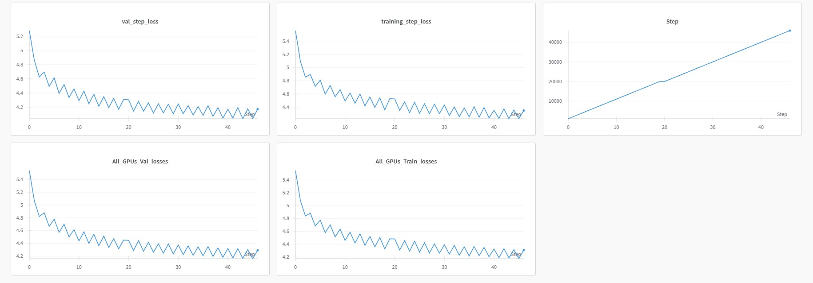
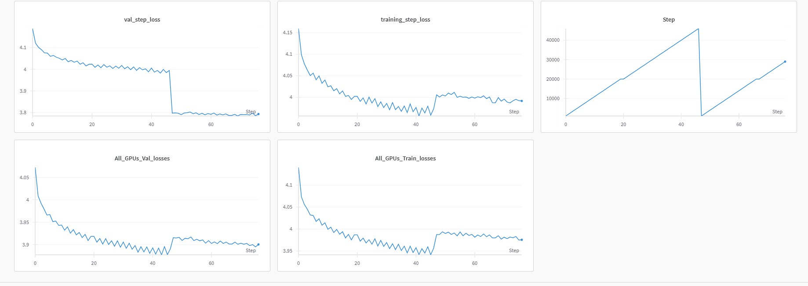
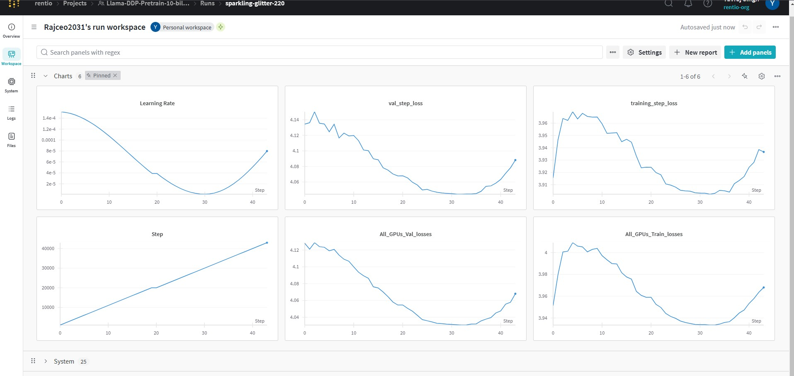
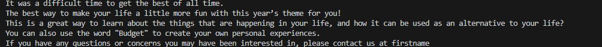
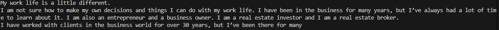

# Introducing SmolLlama - A Smaller Language Model 

- So, I trained a Llama a 130M architecture I coded from ground up to build a small instruct model, going through the below-mentioned stages from scratch.
- Trained on FineWeb dataset form HuggingFace consisting of 15 M texts (10BT snapshot) for a total of full 3 epochs

The three main stages are:

1) Pretraining
2) SFT (Instruction Tuning)
3) Reward Tuning for human-like responses (DPO)


 ### 1) Pretraining

#### Dataset

 - I used the [FineWeb](https://huggingface.co/datasets/HuggingFaceFW/fineweb?row=0) dataset from HuggingFace (10BT checkpoint) consisting of roughly 15M texts.

  1) Train dataset - 12 M texts
  2) Val dataset - 3M texts

- After tokenization (GPT2), a total of 186k batches (a full epoch) were formed for a batch size of 64 across 4x 4090s with 46k batches for each node.

---

####  ModelArgs (Hyperparameters)

| Parameter              | Value         | Description                                                                 |
|------------------------|---------------|-----------------------------------------------------------------------------|
| `block_size`           | 128           | The size of each block.                                                     |
| `batch_size`           | 64            | The number of samples processed before the model is updated.                |
| `embeddings_dims`      | 768           | The dimensionality of the embeddings.                                       |
| `attn_dropout`         | 0.1           | Dropout rate for attention layers.                                          |
| `no_of_heads`          | 6             | Number of attention heads (needs thorough calculation).                     |
| `dropout`              | 0.1           | Dropout rate for the model.                                                 |
| `max_lr`               | 2e-4         | learning rate.                                                      |
| `no_of_decoder_layers` | 6             | Number of decoder layers (needs thorough calculation).                      |
| `weight_decay_optim`   | 0.1           | Weight decay for the optimizer.                                             |
| `beta_1`               | 0.9           | Exponential decay rate for the first moment estimates in the optimizer.     |
| `beta_2`               | 0.95          | Exponential decay rate for the second moment estimates in the optimizer.    |
| `vocab_size`           | 50258         | Vocab size                                                                  |
| `device`               | 'cuda'        | The device to run the model on (e.g., 'cuda:0' for GPU).                    |
| `no_kv_heads`          | 2             | Number of key-value heads.                                                 
---
#### Hardware Setup

 - Used DPP using Pytorch torchrun consisting of 4x GeForce RTX 4090s (24gb VRAM each) rented on runpod.io
 - The model is a 1.5GB in size but needs around 5 GB of VRAM when loaded in fp32 precision
---

#### Frameworks:
**Pytorch**


--- 

#### Epochs/Steps
- Iterations (train) = 45k

- Val iterations = every 1k
---

#### Losses
- Train loss - 3.96

- Val loss - 4.01

---

#### Screenshots of the loss curves

- Epoch 1 with CosineAnnealingWarmRestarts



- Epoch 2 with CosineAnnealing (checkpoint from epoch 1)



- Epoch 3 with CosineAnnealing (checkpoint from epoch 2)



--- 
#### Output

- Prompt: It was a difficult time for me



- Prompt: My work life



---

### Local setup


### Requirements


```python
git [clone the repo](https://github.com/YuvrajSingh-mist/SmolLlama.git)
cd SmolLlama
bash ./install.sh

```
- A wandb.ai account for plotting graphs for your loss curves

- On your terminal run
```python
wandb login
```

- Enter the api key and follow the instructions and once you are succesfully logged in follow the given steps


- Download the model

```python
python donwload_model_weight.py
```


---

### Running 


#### Training a model

- Kindly hange 'device' to any of your available cuda gpus.

To run:

```python
torchrun --standalone --nproc_per_node=gpu llama.py \   
    --epochs 10 \
    --block_size 256 \
    --batch_size 32 \
    --embeddings_dims 1024 \
    --no_of_heads 8 \
    --max_lr 3e-4 \
    --prompt "Once upon a time" \
    --max_length 100 \
    --temperature 0.8
```
--standalone - if all the gpu are on one server
--npro_per_node - number of gpus available and use the keyword gpu to use all

#### Inference on a model

```python 
python inference.py --prompt "Once upon a time" --max_length 100 --temperature 0.8 --repetition_penalty 1.5 
```

